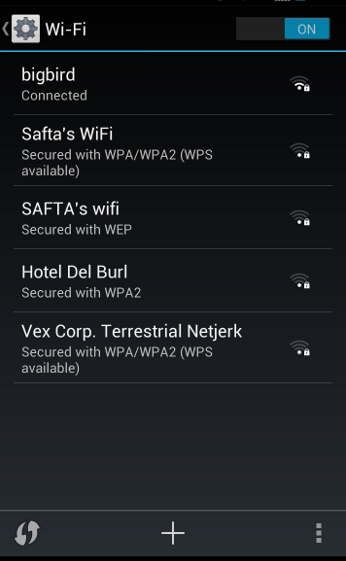
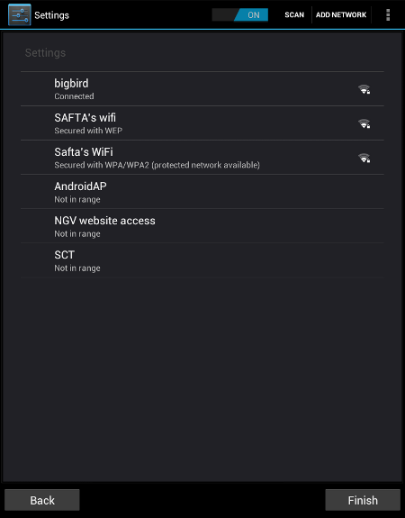

Building Appliances with Android
    
    welcome to the presentation. 
    I am going to talk about building appliances with android.
    
Or how to turn a droid into a toaster

    subtitle

Appliances

    I'm talking about apps designed to take over the device, to be the sole focus of the device.
     
What do I mean by Appliances?

    So what do I mean by appliances?

<pre>
ap·pli·ance  
/əˈplīəns/
Noun

    A device designed to perform a specific task, 
    typically a domestic one.
</pre>

    Well the dictionary says...

    And I mean things like this
    

    And this
    
Interactive Digital Signage Appliances ?
    
    But in my specific case it means interactive digital signage appliances.
    
Interactive Digital Signage Appliances
----

    these.

Customisation

    Now in order to create an appliance using Android you need to be able
    to customise it.

3 Levels 
    
    And with Android you pretty much have 3 levels in which to work at
        
1 User

    By User-level I'm talking about using the normal means that a normal app
    developer or regular device user has at their disposal

2 Platform

    This can be thought of as a quasi root-level access to the device. Because
    Android security model involves protecting sensitive APIs from apps that are
    not sanctioned by the hardware vendor, only apps that are signed with the 
    same certificate as was used when the system image was compiled from source.

No soup root for you!

    The main thing to note here is that with Android devices,
    as with most other phone device OS's, is that unlike with laptops and desktops,
    the end user does not normally have nor is **intended** to have root access to the device.
    Of course anyone working in a corporate environment would already be used to this
    state of affairs but unfortunatly it is now spreading widely in the consumer space.

3 OS

   This is the lowest or deepest level of customisation, where you are infact rebuilding
   the whole operating system from the source, yes wave hello to any Gentoo users out there!
   
   
1 User Level Customisation

Things you can do...

    So what can you do at this level?

Use the Home Intent

    Well you can use the home intent.
    
Small Detour...  
So what are Intents?

    But for those that aren't Android app devs, what is an Intent? 
    Basically they are an IPC mechanism, similar to DBUS. Android is actually 
    really made up of a suite of co-operating components, bundled sometimes 
    as applications communicating through direct and broadcast messages called 
    Intents.

Home sweet home

    
    So what people think of as the home screen or "desktop" on android is really
    nothing more than an app like any other, that has registered to listen for
    a "well known" Intent called Home.
    
<pre>
&lt;activity android:name=".MyHomeActivity"&gt;
    &lt;intent-filter&gt;
        &lt;action android:name="android.intent.action.MAIN" /&gt;
        &lt;category android:name="android.intent.category.LAUNCHER" /&gt;
        
        &lt;category android:name="android.intent.category.HOME"/&gt;
        
        &lt;category android:name="android.intent.category.DEFAULT" /&gt;
    &lt;/intent-filter&gt;
&lt;/activity&gt;
</pre>

    Registering for receiving the Home intent (or infact any other Intent) is as
    easy as this bit of XML configuration code.

Use "public API" Intents (eg. Wifi config)
    
    Use "public API" Intents for example Wifi configuration.

Sending Intents is easy!

    It turns out that sending Intents is pretty as easy as registering to
    receive them.   
    
<pre>
Intent intent = new Intent(WifiManager.ACTION_PICK_WIFI_NETWORK);

startActivityForResult(intent, 1);
</pre>
    
    This is what the code looks like to show the wifi configuration screen.
    I kid you not, its that easy. For Java code that is zen like minimalism!

Oops...  

    
    But using the public wifi configuration intent leaves us with a problem.
    If our intention is to build an appliance, we dont want the user to see
    the usual android navigation bar control, but we still need a way for them
    to indicate they have finished setting up their wifi settings.
    
 ?
    
    But google devs must have run into the same problem when creating the setup 
    wizard that ships on most recent android devices. And like me they must be
    big kirk fans, because in these situations I always think...
 
What would Kirk do?  

     what would Kirk do?
     Yes thats right, change the rules of the game.
    
<pre>
Intent intent = new Intent(WifiManager.ACTION_PICK_WIFI_NETWORK);

intent.putExtra("only_access_points", true);
intent.putExtra("extra_prefs_show_button_bar", true);
intent.putExtra("wifi_enable_next_on_connect", true);
intent.putExtra("extra_prefs_set_next_text", "Finish");

startActivityForResult(intent, 1);
</pre>
    
    And so if we look into the android source, it turns out that there are 
    actually these strange, **undocumented**, special case parameters that you
    can pass along with the intent code of the Wifi config application, 
    that you can pass and ...

Dada!  

    and dada!

2 Platform Level  
Things you can do...  

* Call "Privilaged" APIs (eg. Reboot)  
* *SILENT* OTA updates for your apps

    Now how can you get platform access? Well 2 ways, the first is that someone
    like the hardware vendor who the android system image for the device can 
    give you the certificate used to sign it. The second way I'll talk about in 
    a minute.
    So once you have platform access, what can you do? Well you can call those
    restricted system API like for rebooting the device.
    
Silent?

    You can also call, "hidden" (ie undocumented) APIs that let you do things
    like silently install apps or update apps on the device. By silently I mean
    normal apps have a public api that they can call to install a new app on a 
    device, but that then displays a onscreen prompt for the user to acknowledge
    and allow the install to go ahead - or not. But with this hidden platform 
    level API, you can just do it in the background with the user none the 
    wiser.

3 OS Level Customisation

    So actually I lied...

Actually a Trilogy in 4 parts  

1. User  
2. Root  
3. OS -> __Android Framework__  
4. OS -> __Kernel__

    there's really 2 parts to the OS-level customisation,
    customisation at the Android Framework layer and below that at the Linux
    kernel layer.

3 OS - Android Framwork Customisation

    So how do customise the android framework?

AOSP and Building Android  

* hundreds of git repos  
* huge amounts of disk space req'd  
* min 1hr on a __very__ **fast** machine !  
* and then you need to build img & test on emu/device :-(
    
    Well, you need to build is from source - hey thats what this open source gig
    is all about sin't it?
    So building android is fairly straight forward but you have to keep in mind
    you are essentially building a whole linux distrubtion from source.
    
4 OS - Android Customisation  
Things you can do:..

* choose which apps to ship  
* customise UI (eg. remove Systembar in ICS)  
* choose CPU platform (eg. x86 instead of ARM)  
* workaround bugs in hardware (eg. bad LCD EDID)  
* *control* the platform - use __your own__ signing certs

    Once you get to this level, you have a whole lot of control. 
    Now before when I talked about 

OS - Kernel

* device drivers, eg. non-HID touchscreens
* ...?

    This is just like building a custom kernel for your favourite desktop distro.
    The reasons you would do this are the same, such as adding support for an
    unusual piece of hardware like a non-HID touchscreen for example.

DEMO !

    So now I'll hopefully show you a some of the customisations I've talked 
    about...

Thank You!  
Questions?  

blog.manichord.com  
maks@manichord.com  
github.com/maks  
@mklin

    Thank you - any questions